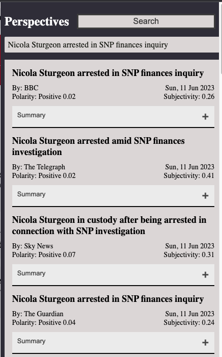
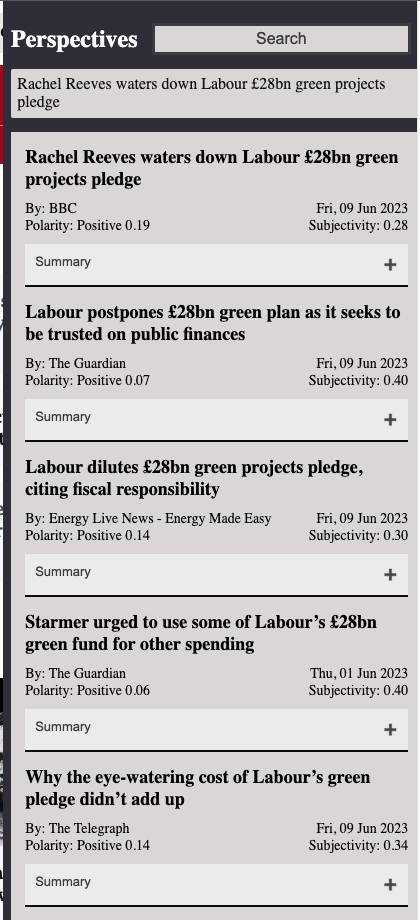
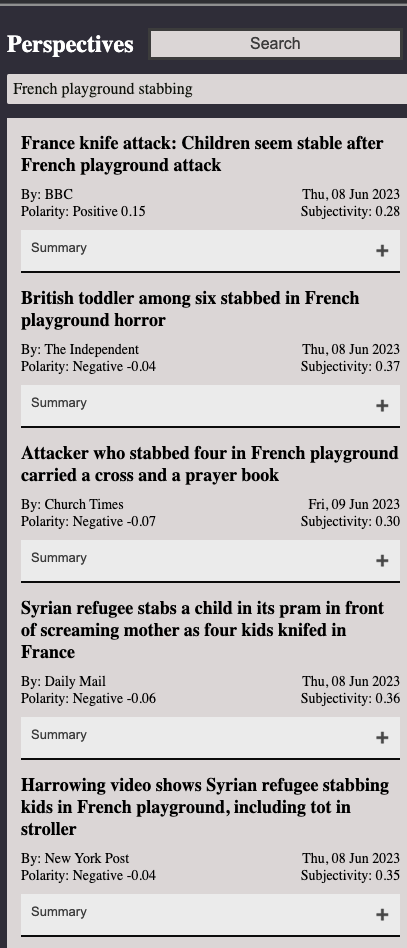

**What is the problem?**

With the rise of misinformation, fake news, and generally polarised content online - it’s become harder and harder to trust what we read. There’s often always a slight bias, a slight differing word choice, if not blatant one which tries to influence the reader - unintentionally or not. This can take a far more subtle form than the obvious examples we hear about, it isn’t always about somebody claiming vaccines cause autism, it can be as subtle as framing a political decision either negatively/positively, it can be a seemingly harmless ‘story’ told about a migrant stealing a job, with no proof it happened… 

Coming from a very scientific background - it always felt really important to know the ground truth and I’m constantly frustrated by how much online content often presents only one side of the story. 

**Why is this problem hard?**

The problem of misinformation is inherently tricky - as it requires we agree on truth, and find an authority to enforce it, a historically difficult issue, one that leads down many dark paths. We cannot police misinformation at the cost of free speech, we cannot blur the lines between peddling of falsehoods and criticism of government, and lead us down the route of autocratic states. One does not need to look far to find endless examples of how giving the power to decide/enforce ‘truth’, and any sort of power over media and speech to the state ends badly. 

At the same time, when our countries are becoming increasingly diverse, and social media enables the spread of information like wildfire, its very easy for a country to be polarised and divided by people creating fake news, scaremongering and straight up lying to play upon people’s existing fears and sway them to their point of view.  

There is really no easy solution to this - regulation is hard, and the current state of the world, and the economic systems we’ve landed ourselves in mean that:

- The people who decide what is fake news are [marginalised content moderators, often in third world countries](https://www.stern.nyu.edu/experience-stern/faculty-research/who-moderates-social-media-giants-call-end-outsourcing), who are shown the worlds worst on repeat every day of the week for hours on end,
- Following guidelines crafted by teams in the biggest social media companies, who, as well-intentioned as they might be, [are still weighing up this fight versus the profit margins](https://knowledge.wharton.upenn.edu/article/social-media-firms-moderate-content/) and safety of their company,
- And often fail when it comes to [addressing the world’s diversity](https://www.cfr.org/blog/cyber-week-review-april-15-2022)…

*If we can’t rely on current incentives in our economy, and can’t rely on government regulation to stop this - what can we do?* 

**Can we change the way we consume Content?**

*For me the only reasonable answer to the problem above - is to change the way we consume content itself. To look at everything more critically, to dig into the facts and opposing perspectives behind every statement we hear, and try to find a reasonable point of view before letting it influence us.* 

However, this is far easier said than done - so before proposing solutions, I wanted to try to see for myself - if I could find the ‘balanced perspective’ while reading news. I decided to try to do that by *comparing every news article I read about an event with a bunch of different perspectives.* 

**Experimenting with a Chrome Extension**

To do so - I built a quick chrome extension [(github repo here)](https://github.com/keshav123456/perspectives/tree/master). What it does is take a news article headline - and when selected, opens up similar news articles - but from *different newspapers/websites. It also provides a summary, and a polarity/subjectivity rating based on some simple NLP metrics.* 

This allows us to quickly compare what different news sites say about the *exact same event.* This results in some really interesting perspectives - we see for example that all British news organisations used the exact same wording when talking about Nicola Sturgeon’s arrest. However when talking about Labour’s green plan, the BBC and Telegraph use words such as ‘waters down’ and say it doesn’t ‘add up’ - yet the Guardian chooses to talk about it being ‘postponed’, and frame it positively, as Labour seeks to be ‘trusted’. This illustrates the subtle differences that slowly build up to wider polarisation among audiences - if one audience only reads the guardian, and one only the Telegraph - how can we expect them to be on the same page when discussing Labour’s Green Plan? How can we expect them to come together collaboratively? 

Following on, we can clearly see the difference between the BBC/Independent’s style of reporting, versus the Daily Mail/New york post - with the latter choosing to talk about the perpetrator’s origin, and the screaming, whereas the former have a more measured tone. 

**Can we learn anything from this?**

While there isn't really a solution to be found here, it does open your eyes to the whole host of subtle ways different news websites write articles, and *why different people may hold such vastly different opinions from similar events.* 

So perhaps the better question is - *can we find incentives for people to consume a variety of content?*